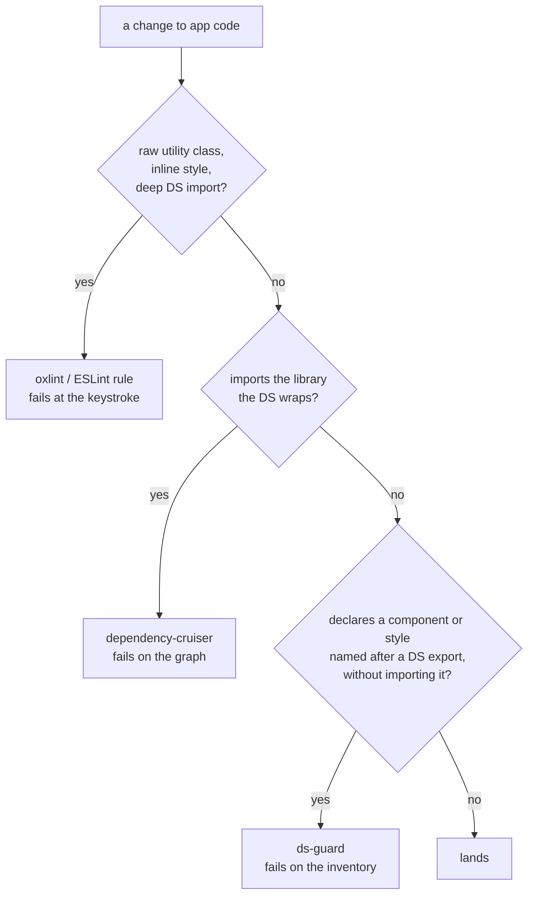

# ds-guard — catching design-system reinvention

A design system only pays off if application code actually uses it. Most repos
guard that with a linter and a dependency graph, and both are genuinely good at
their jobs — but they share a blind spot, and it is the one that hurts most.

## The blind spot

Design-system violations come in three shapes.

| Shape                      | What it looks like                                                         | What makes it detectable                        |
| -------------------------- | -------------------------------------------------------------------------- | ----------------------------------------------- |
| Reaching **past** the DS   | `className="bg-blue-500"`, `style={{ padding: 8 }}`, `@acme/ds/src/Button` | a token that is **present** in one file         |
| Reaching **around** the DS | `import { Switch } from "@base-ui/react"` in app code                      | an edge that is **present** in the import graph |
| **Reinventing** the DS     | `<div role="switch">` beside a `.switch {}` class                          | nothing                                         |

A linter matches things that appear. A dependency cruiser matches edges that
exist. Reinvention is neither: the file that hand-rolls a toggle has no banned
class, no banned import, and no edge to the design system at all. It is defined
by an **absence**, and you cannot write a rule that forbids an absence without
first knowing what should have been there.

That is the whole idea here. Knowing what should have been there means holding
two things at once — the design system's export list, and the consumer tree —
which is a cross-file question and therefore not a lint rule.

## The three layers



Layers 1 and 2 are per-file and per-edge, so they are fast and exact, and they
belong in whatever linter the repo already runs. Layer 3 needs the whole picture
and is what lives in this directory.

The layers are deliberately redundant where they overlap. The oxlint plugin in
`../oxlint/ds-plugin.mjs` flags `<div role="switch">` the moment it is typed,
which is where a fix is cheapest; ds-guard flags the same component again from
the repo-wide view, which is where it cannot be ignored.

## How ds-guard decides

It reads the design system's exported names **from the barrel**, never from a
list in config — a hand-kept copy stops matching the day someone adds a
component, and does so silently.

Then, for every consumer file, it collects two kinds of name the file has
claimed for itself: components it declares, and styles it references (CSS-module
classes, or `StyleSheet.create` keys — see `styleSources`). Each is judged by
three rules that exist entirely to keep the signal above the noise:

**Match the head noun, not every word.** In English the last word of a compound
identifies it: a `photoCard` _is_ a card, a `cardBody` is a _body_. Matching
every word instead flags every modifier class on a component as a reinvention of
it, and the real finding drowns in its own siblings.

**Match a compound export only whole.** `TextArea` indexed under `area` claims
`PicnicArea`; `MenuBar` under `bar` claims `ProgressBar`. A multi-word export
name identifies that component, not everything ending in its head noun.

**Composition is not reinvention.** A file that declares `PhotoCard` _and_
imports `Card` is doing exactly what a design system is for. The import is the
tell, so the finding is dropped.

Attribution matters as much as matching. A style name belongs to a file only if
that file **references** it; stylesheets get shared across a directory, and
"declared in a sheet this file imports" would blame every file in `blog/` for
every class in `blog.module.css`.

### What it reports

| Rule                   | Severity | Meaning                                                                                                                                              |
| ---------------------- | -------- | ---------------------------------------------------------------------------------------------------------------------------------------------------- |
| `reinvented-component` | error    | A local name matches a DS export the file does not import. Use it, or extend it.                                                                     |
| `missing-primitive`    | warn     | A local name builds a control (`switch`, `slider`, `pill`…) the DS exports nothing for. Either a gap worth filling, or a one-off that should say so. |
| `unused-export`        | info     | The DS exports it and no consumer imports it — the inverse smell.                                                                                    |

`missing-primitive` is the one that answers "am I confident the app uses what it
should?", because it turns a vague worry into a list of controls the design
system never grew.

The run closes with two coverage numbers — consumer files importing the DS at
all, and DS exports with at least one consumer. Neither fails the build. They
are there so the trend is visible in CI logs without anyone maintaining a metric.

## The baseline, and why a rough heuristic is still worth shipping

Every check here is a heuristic over names. Heuristics have false positives, and
the usual response — tune until precision is perfect, ship nothing meanwhile —
is why most repos have no layer 3 at all.

The baseline dissolves that. `--update-baseline` writes today's findings to
`baseline.json`, and the check then fails only on findings that are **not** in
it. Precision stops being a blocker, because a false positive on existing code
costs one line in a file nobody reads, while a false positive on _new_ code
arrives in front of a reviewer who can judge it in seconds.

The ratchet turns the other way too: a baseline entry that no longer occurs is
an **error**. Paying off debt means deleting its line, so the file cannot quietly
drift into fiction the way a stale ignore-list does.

```bash
pnpm ds-guard                 # check; fails on new findings and on stale entries
pnpm ds-guard --update-baseline   # accept today's findings
pnpm ds-guard:test            # the guard's own tests, fixtures included
```

## Adopting it in another repo

The script depends on nothing but Node, so it runs the same under oxlint, ESLint
or neither. Copying it into a second repo forks it, so whichever copy is treated
as authoritative, changes have to be carried to the others deliberately — two
copies drifting apart is the problem this tool exists to catch.

1. Copy `ds-guard.mjs`, `ds-guard.test.mjs` and `__fixtures__/` into the target
   repo, keeping them two directories below the repo root — config paths resolve
   relative to that.
2. Write `config.json` (see below) and run `--update-baseline`.
3. Read the `missing-primitive` findings before anything else. They are the
   design system's backlog, written by the app.
4. Add `ds-guard` to CI next to the dependency-graph step.
5. Port `../oxlint/ds-plugin.mjs` if the repo runs oxlint; under ESLint the same
   two rules transfer almost verbatim, as both take an ESTree-shaped visitor.

### `config.json`

| Key                    | Meaning                                                                                                                                                                                        |
| ---------------------- | ---------------------------------------------------------------------------------------------------------------------------------------------------------------------------------------------- |
| `designSystem.package` | The import specifier consumers use, e.g. `@jordanscamp/ds`. Subpaths count.                                                                                                                    |
| `designSystem.barrels` | Public entry point(s), relative to the repo root. Exported names are read from here.                                                                                                           |
| `consumers`            | Directories of application code to scan.                                                                                                                                                       |
| `usageScopes`          | Directories counted towards usage but never judged for reinvention. A DS that ships whole screens is its own biggest consumer; without this, every atom those screens compose reads as unused. |
| `styleSources`         | `cssModules` or `reactNativeStyleSheet`.                                                                                                                                                       |
| `extensions`           | File extensions to scan. Defaults to `.ts`/`.tsx`.                                                                                                                                             |
| `exclude`              | Regexes tested against repo-relative paths. Defaults exclude tests, stories and `dist`.                                                                                                        |
| `baseline`             | Baseline filename, relative to this config.                                                                                                                                                    |

Adding a styling mechanism means adding one function to `STYLE_EXTRACTORS`: it
takes a file and its source, and returns the style names that file claims. Every
check downstream is written against that list, not against CSS or JS.

## What it will not catch

A component that reinvents a DS component under an unrelated name — a `Doohickey`
that is really a Card — is invisible to a name-based check, and honestly so. The
oxlint rules narrow that gap for controls, because a hand-built control has to
declare its `role` whatever it calls itself, but nothing here replaces reading
the diff.
